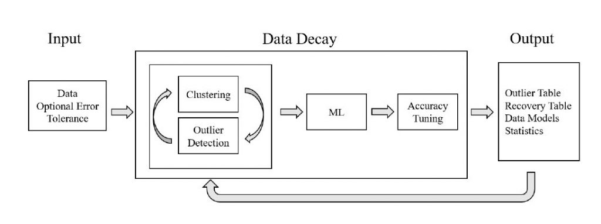

Kudos to Scott Heyman, Anna Baskin, and Brian T. Nixon for collaborating and presenting the paper, titled “Remembering the Forgotten: Clustering, Outlier Detection, and Accuracy Tuning in a Postdiction Pipeline” at the European Conference on Advances in Databases and Information Systems (ADBIS2023) in Spain. For further details, please refer to the paper under the [ADMT Lab’s Publications](https://admt2501.cs.pitt.edu/pubserver).

