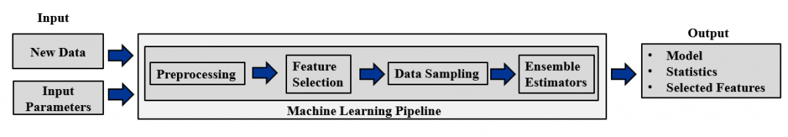

Kudos to Anna Baskin and Brian T. Nixon for collaborating and presenting the paper, titled “RETSINA: Reproducibility and Experimentation Testbed for Signal-Strength Indoor Near Analysis” at the International Conference on Indoor Positioning and Indoor Navigation (IPIN2023) in Germany. For further details, please refer to the paper under the [ADMT Lab’s Publications](https://admt2501.cs.pitt.edu/pubserver).

